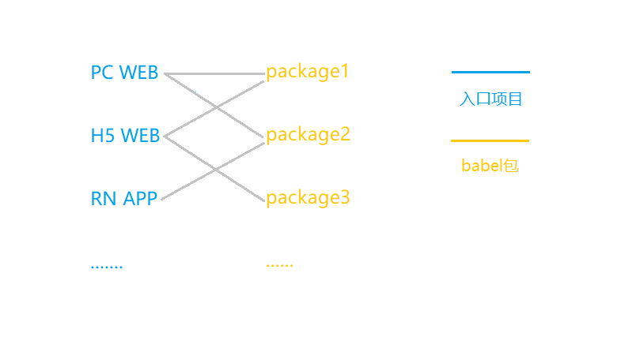

# IceE

[](https://github.com/IceEmblem/IceE)
[](https://www.npmjs.com/package/icetf)

IceE 是一个基于 React 的多项目框架，你可以在该框架中添加多个启动项目（如：create-react-app，react-native 等），IceE 基于模块化的设计，monorepo 项目，其项目结构如下：



## 开始使用
**克隆项目或下载项目** </br>
git clone https://github.com/IceEmblem/IceE.git

**安装包** </br>
yarn install </br>
注：必须是 yarn，不能使用 npm，因为项目使用了 yarn 的工作区

**运行 Web 端** </br>
yarn start:web

## 编写一个模块
如何编写一个模块，并发布给其他人使用？
1. 执行 node icee -c "ice-react-mytest" 创建 ice-react-mytest 包
2. 执行 yarn workspace ice-react-start add ice-react-mytest 在 ice-react-start 添加包引用
3. 在 ice-react-start 的 Module 添加依赖
```javascript
import { Module as MyTestModule } from 'ice-react-mytest';

// 添加MyTestModule的依赖
ModuleFactory.register(module, [
    ...
    MyTestModule
]);
```
4. 进入 /packages/ice-react-mytest，修改 Module.js 文件
```javascript
import React from 'react'
import {BaseModule, PageProvider, ModuleFactory, Page} from 'icetf'
import {Module as CoreModule} from 'ice-core';

class Module extends BaseModule
{
    initialize(){
        // 注册页面，访问 /mytest 将显示这个页面
        PageProvider.register({
            name: "mytest",
            url: "/mytest",
            element: <div style={{ width: '100%', height: '100%', display: 'flex', justifyContent: 'center', alignItems: 'center' }}>
                <p>Hello World!!!</p>
            </div>
        });
    }
}

const module = new Module();
export default module;

ModuleFactory.register(module, [CoreModule]);
```
5. 根目录执行 yarn start:web 运行web站点，访问 /mytest，就可以查看刚才的页面了
6. 根目录执行 node icee -b "ice-react-start" 生成 ice-react-start 所依赖的包，进入到 ice-react-mytest 模块目录，执行 npm publish 发布你的模块，这样其他人就可以直接安装并使用你的模块了
</br></br>

## 新增一个入口项目
你已经有了PC端程序，现在想要新增一个H5端程序或者RN程序，如何实现？ </br>
其实实现起来很简单，已可以参照 ice-react-start 模块的 index.js 和 module.js 代码 </br>
当然，更好的方法时复制一份 ice-react-start 并改个名就可以了 </br>

## 命令
**执行如下命令查看所有命令** </br>
node icee

**调试** </br>
node icee -s "入口模块运行命令" "入口模块名"

**创建包** </br>
node icee -c "模块名"

**babel 编译项目所依赖的包** </br>
node icee -b "入口模块名"
</br></br>

## 打包
1. 执行 node icee -b "入口模块名" 编译项目所依赖的包
2. 进入项目执行项目的打包命令

</br></br>

## 文档
框架文档：https://blog.csdn.net/dabusidede/article/details/119010741 (已过时，待更新)
</br></br>

## 我们提供的包
### ice-common 包
#### 安装
1. 添加包 yarn workspace ice-core add ice-common </br>
2. 在 ice-react-start 中注册缓存方法（ice-common 需要用到缓存，所以需要在入口处设置缓存方法） </br>
```javascript
import { Storage } from 'ice-common';

export default class StartModule extends BaseModule {
    preInitialize() {
        // 初始化 Storage
        Storage.setItem = (key, value) => {
            localStorage.setItem(key, value);
            return Promise.resolve();
        }
        Storage.getItem = (key) => {
            return Promise.resolve(localStorage.getItem(key));
        }
        Storage.removeItem = (key) => {
            localStorage.removeItem(key);
            return Promise.resolve();
        }

        // 初始化token
        return token.init();
    }
}
```
3. 运行项目 yarn start:web </br>

## 加入项目
项目目前由我一人维护，有兴趣加入项目可以联系我哈，邮箱：1373611035@qq.com，qq：1373611035
